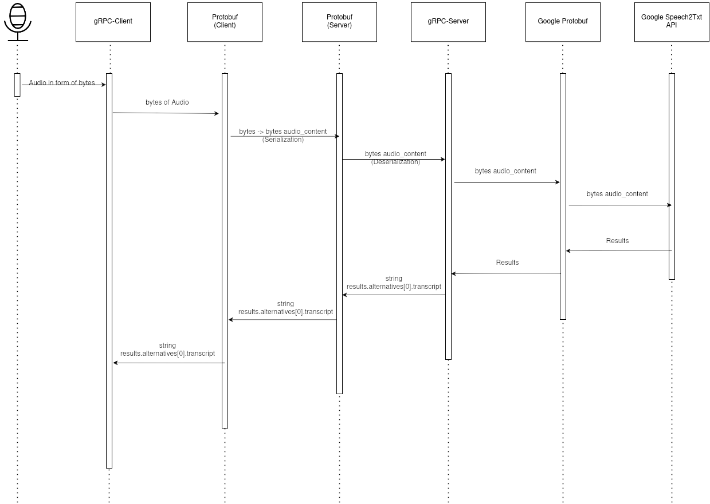
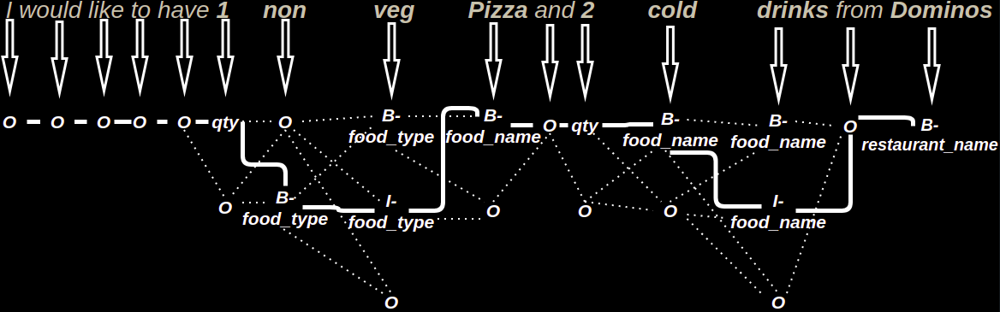
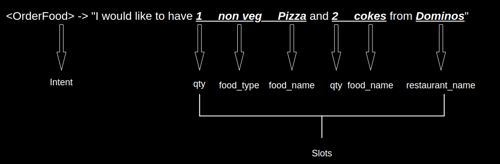
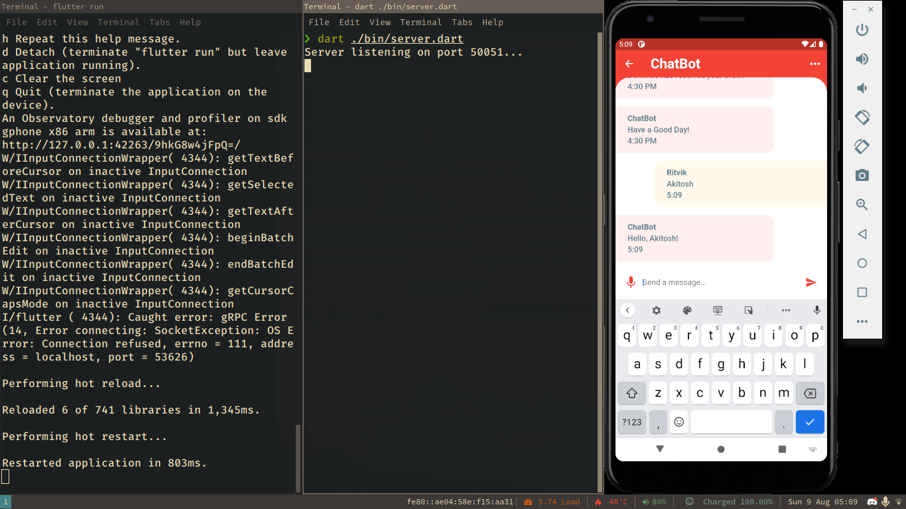
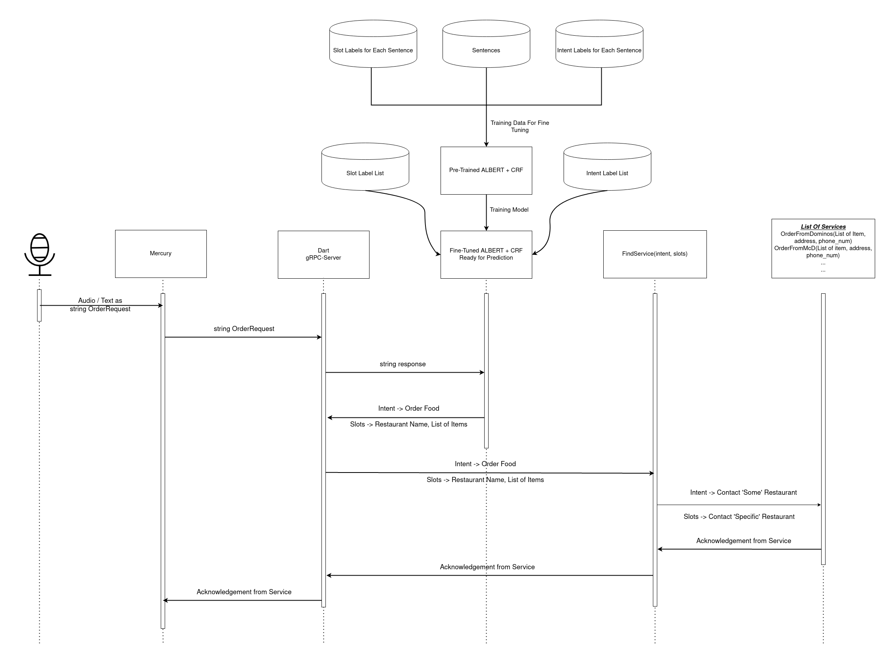
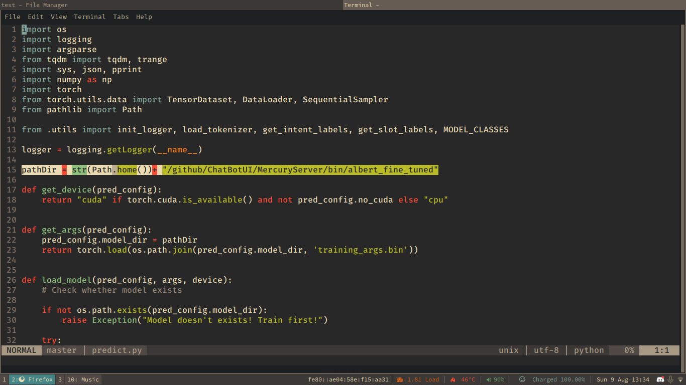
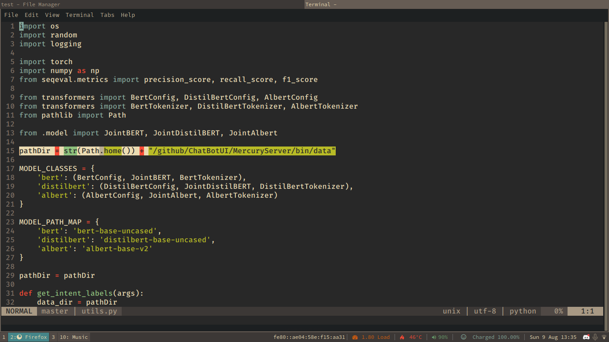

# Mercury
by Bodega-CoderzZz

# Overview
- A Chatbot that can take Audio as Input and connect the user to some service
	* like a telephone operator, but with instant messaging
	* currently, we only have oredering of food, and our app is not connected to any buisness.
	* we do however successfully extract the intent of the user, and this information can be formatted as desired

- For Example : Input -> “I would like to have *1 non veg Taco* and *3 veg Pizzas* and *three cool drinks* from *Dominos*”
- Output ->
```
{
	"intent": "OrderFood",
	"slots": {
		"food_type": [
			"non veg",
			"veg",
			""
			],
	"food_name": [
			"Taco",
			"Pizzas",
			"cold drinks"
		],
	"qty": [
		"1",
        "3",
		"three"
	],
	"restaurant_name": "Dominos"
	}
}
```


# Speach to Text with gRPC



- A gRPC-server which takes audio as input from it’s client and sends it to Google-Cloud-Speech API
- The Cloud-Speech API transcribes this audio to text and sends it back to the server
- This text is then sent back to the client.
- The client-server pair has bi-directional stream of data where audio is converted to text in real time and displayed word for word.


# Intent Extraction:
## ALBERT ‘Fine-Tuned’ Model

- ALBERT is a pre-trained model with open-source code which has been trained on BookCorpus (800M Words) and English Wikipedia (2500M Words).
- This pre-trained model has the ability to extract each word’s “contextual meaning” in the text.
- For Example : Order a book.
	Book an order.
- The model can deduce that book in the first sentence is a noun and a subject, and that Book in the second sentence is a verb meaning ‘place an order/make a reservation/appointment’.



- Here, The arrows represent alBERT associating words to their meanings in context with the sentance they are in
- during training alBERT gains experience with associating words with certain tags.
---
## Conditional Random Field (CRF)
- A machine learning method for associating inputs with one of a list of potential features.
- We are going to use this ON-TOP-OF ALBERT.


- CRF does Slot-Identification for each word by mapping the words' possible labels with each other and figuring out which mapping makes the most sense.
- **note : The bold line represents the most probable sequence**



---

## Partially complete Front End with Flutter
- we now have a flutter UI
- the template can now communicate with a simple grpc server and exchange text with it.
- We are yet to connect our ML back-end to our UI, but there's at least smooth connection between the dart grpc server and the flutter client




## full project overview:


- flutter front-end connects to the grpc server. user messages are sent
- server recieves messages and executes a Python script to call on the ML model to process the user's message
- the script writes a file with the predictions
the server reads this file and gives a response to the user that lists their order.
- currently our app does not interface with any buisness. but it extracts data that can easily be modified for integration with buisnesses like swiggy, zomato etc.

---

# installation

## Dependencies
- alBERT:
	* Huggingface Transformers:
	```
	$ git clone https://github.com/huggingface/transformers
	$ pip install ./transformers
	```
	* pytorch/torch and pytorch-crf:
	```
	$ pip install pytorch pytorch-crf
		(or)
	$ pip install torch pytorch-crf
	```
	* install words2numbers
	```
	$ pip install words2number
	```
	* install grpcio-tools
	```
	$ pip install grpcio-tools
	```
	* change pathDir variable in
	 + ./MercuryServer/bin/test/predict.py, and
	 + ./MercuryServer/bin/test/utils.py
	so that the path from home is intact.

	

	

- flutter and Dart_server:
	* from ./mercury run:
	```
	$ pub get
	(or)
	$ flutter pub get
	```
	* and from ./MercuryServer run:
	```
	$ pub get
	(or)
	$ dart pub get
	```
these will automatically update dependencies fot the app, and the server respectively.

- In ./mercury/lib/services/ChatServicer.dart, change the IP address 192.168.x.x to match your system's IP.

- On your Phone enable usb debugging from dev options and connect it to your system.
- start the server by running dart MercuryServer.Dart
- run the app by executing "$ flutter run" in ./Mercury directory
